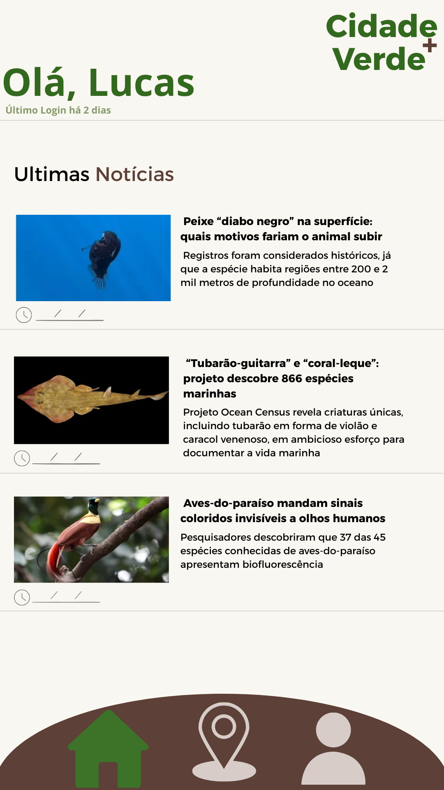
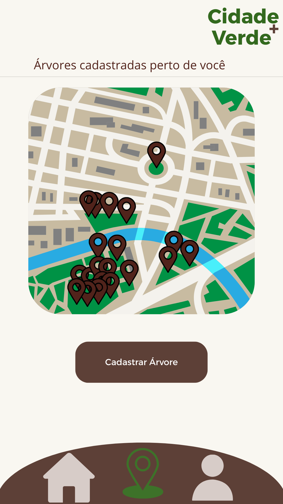
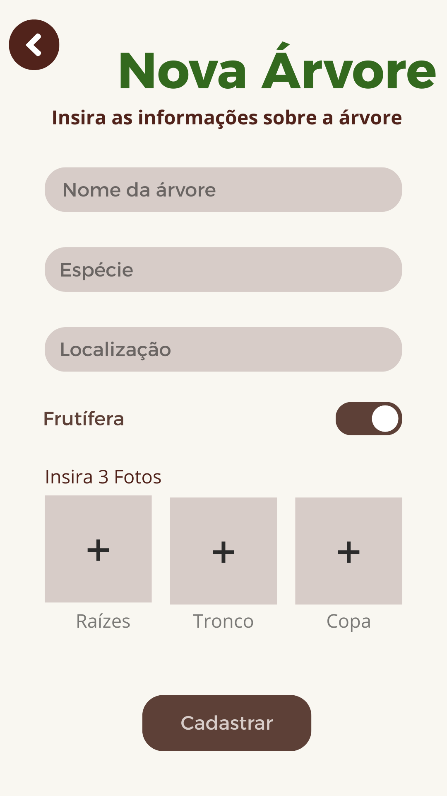
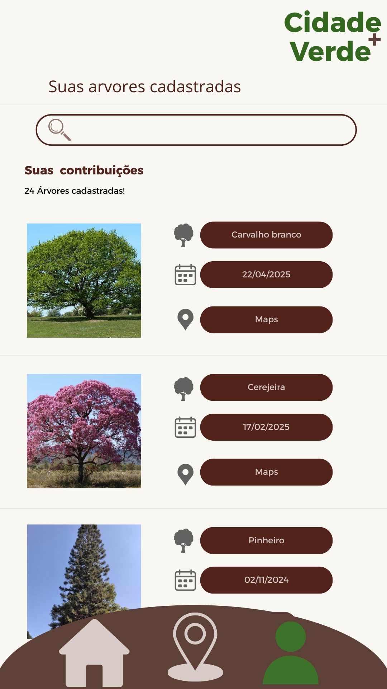

# Cidade+Verde

Neste Repositório se encontra o design do protótipo do app Cidade+Verde que está em desenvolvimento.
O projeto foi iniciado durante a matéria de Programação para dispositivos móveis, 5° Semestre de Ciências da Computação.

---

## Tela de login

---

## Tela de Cadastro

---

## Home

---

## Árvores Próximas

---

## Cadastro de Árvores

---

## Minhas Contribuições

